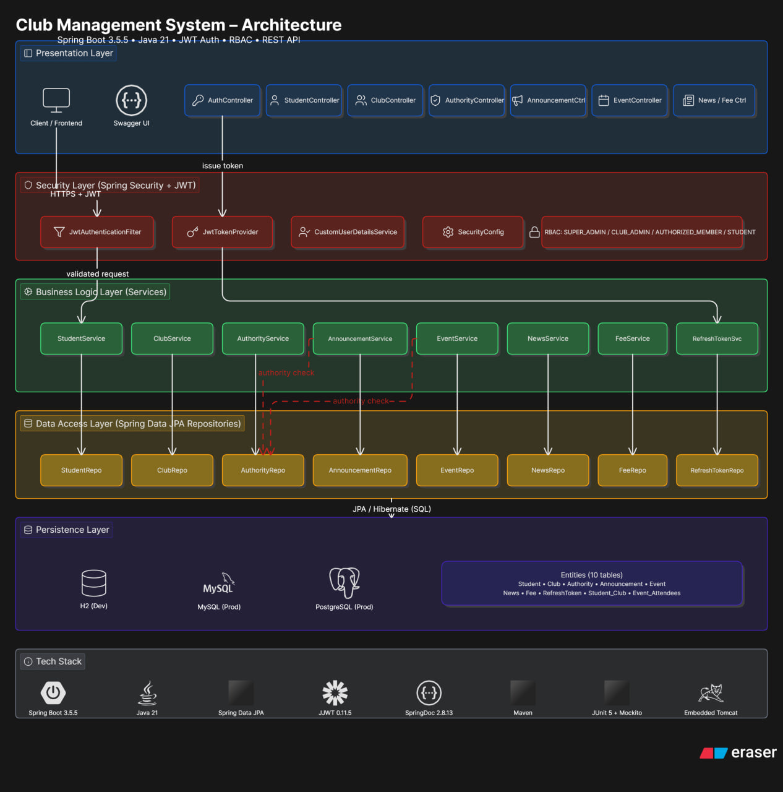

# Club Management System API

   

A concise, production-oriented Spring Boot backend for managing university clubs: members, authorities, events, announcements, fees and administrative workflows. This README is tailored for hiring managers — highlighting architecture, tech, key features and how to run the project quickly.

---

## One-line Pitch

Enterprise-ready REST API implementing RBAC, JWT security, and an extensible modular design to power university club operations and events.

---

## Why this project matters

- Production-minded: clear separation of concerns, JWT security, input validation, and testable services.
- Scalable: designed for RDBMS (MySQL/Postgres) with easy migration to caching/queues.
- Demonstrates full-stack backend skills: API design, security, DB modeling, testing, and deployment.

---

## Architecture



High-level: Controllers → Services → Repositories → Database. JWT-based auth, method-level authorization (@PreAuthorize) and OpenAPI docs.

---

## Tech Stack (highlights)

- Java 21, Spring Boot 3.5.5
- Spring Security + JWT (jjwt 0.11.5)
- Spring Data JPA + Hibernate
- OpenAPI (springdoc) for API docs
- H2 (dev), MySQL / PostgreSQL (prod)
- JUnit 5, Mockito for testing

---

## Core Capabilities

- Clubs: create/update/list with club types
- Authorities: assign roles (President, Secretary, Treasurer, etc.) with validity ranges
- Members: register students, join clubs, membership status
- Announcements & News: role-restricted publishing
- Events: create events, attendee registration, attendance tracking
- Fees: configurable fee entries and student billing records

---

## Quick Start (30s)

1. Clone & build

```bash
git clone https://github.com/Yobil-Job/Club_Managment_System_Api_springboot.git
cd Club_Managment_System_Api_springboot
mvn clean package
```

2. Run (H2 in-memory by default)

```bash
java -jar target/club_managment_api-0.0.1-SNAPSHOT.jar
# or for dev
mvn spring-boot:run
```

3. Open

- Swagger UI: http://localhost:8080/swagger-ui.html
- Health: http://localhost:8080/actuator/health

---

## Example: Create Announcement (curl)

```bash
curl -X POST http://localhost:8080/api/announcements \
  -H "Authorization: Bearer <ACCESS_TOKEN>" \
  -H "Content-Type: application/json" \
  -d '{"clubId":2,"title":"Weekly Meetup","description":"Cloud topics","createdById":1}'
```

---

## Security & Best Practices

- JWT stateless authentication, BCrypt password hashing
- Role-based access controls enforced both at endpoint and service levels
- Input validation via Jakarta Bean Validation (@Valid)
- Parameterized JPA queries prevent SQL injection
- CORS configurable for frontends

---

## Testing

Run unit & integration tests:

```bash
mvn test
```

Aim: service-layer focused unit tests (Mockito) and integration tests (MockMvc / @SpringBootTest).

---

## Deployment (short)

Dockerfile provided — build image and run with environment variables for production DB and JWT secret.

```bash
docker build -t club-api:latest .
docker run -e SPRING_DATASOURCE_URL=jdbc:postgresql://db:5432/club_db -e SPRING_DATASOURCE_USERNAME=postgres -e SPRING_DATASOURCE_PASSWORD=secret -e JWT_SECRET=securekey -p 8080:8080 club-api:latest
```

---

## Where to look in the code 

- Entry point: `src/main/java/com/club/api/club_managment_api/ClubManagmentApiApplication.java`
- Controllers: `controllers/` (ClubController, EventController, etc.)
- Business logic: `Service/` (authority checks, validations)
- Security: `config/SecurityConfig.java`, `config/JwtConfig.java`
- Entities: `models/` and SQL schema in `src/main/resources/data.sql`
- API docs config: `config/OpenApiConfig.java`

---

## Contact 

Developer: Eyob — Software Engineer
- GitHub: https://github.com/Yobil-Job
- LinkedIn: https://www.linkedin.com/in/eyob-weldetensay-a68160254/


## License

MIT — see LICENSE file.


